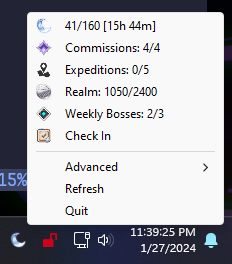
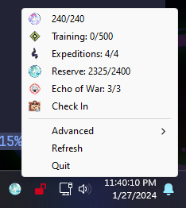
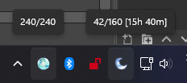
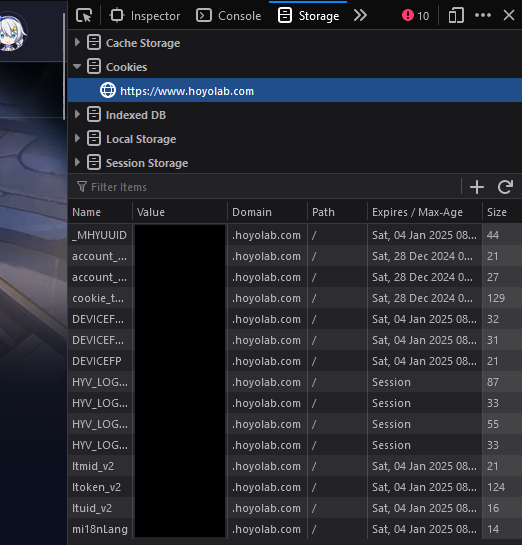

# 📝 Genshin Real-Time Notes
Add your real-time notes to your system tray!

<p align="center">
    &nbsp;
    
</p>
<p align="center">
    
</p>

# 🛠️ Installing (pre-built binaries)
- You can download a pre-built .exe from the releases tab
- Run the .exe once to generate the default `config.json`
- Fill out the config with your data. (See below for steps to get your info)
- The easiest way to run the program will be to create a shortcut to it
- Make sure the config.json is in the same directory as the .exe

# 🍪 Getting session info from hoyolab
1. First go to https://www.hoyolab.com/home and log in
2. Press Ctrl + Shift + I to open the developer menu
3. On Firefox, navigate to the Storage tab
    - The process should be similar on other browsers
4. Under cookies, select https://www.hoyolab.com

<p align="center">
    
</p>

5. Below should be the values needed to fill in the config file
    - `ltuid_v2` is the same as `ltuid` in the config
    - `ltoken_v2` is the same as `ltoken` in the config
    - `genshin_uuid` is your uuid found in-game in the bottom right
    - `server` be the string corresponding to the first digit of your Genshin uuid:
        - 1: cn_gf01
        - 2: cn_gf01
        - 5: cn_qd01
        - 6: os_usa
        - 7: os_euro
        - 8: os_asia
        - 9: os_cht

# 🏃‍♂️ Run on startup
- Create a shortcut to the .exe
- Press `Win + R` and type in `shell:startup` and hit Enter.
- Copy the shortcut to this location

# 🚧 Building from source
## Windows
- Clone the repo:
```
git clone https://github.com/Beastwick18/genshin-real-time-notes
cd genshin-real-time-notes
```
- Run the following command:
```
make
```
- Which will generate `resin.exe`
