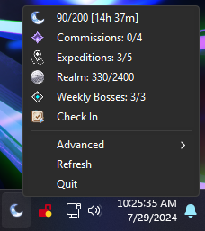

<h1 align="center"> <br />Genshin Real-Time Notes</h1>

Add your real-time notes to your system tray!

<p align="center">
    &nbsp;
    
</p>
<p align="center">
    
</p>

# 🛠️ Installing (pre-built binaries)
- Download the [latest .exe release](https://github.com/Beastwick18/genshin-real-time-notes/releases/latest) from the releases tab for `stamina.exe`, `resin.exe`, or `charge.exe` for Genshin, Honkai: Star-Rail, or Zenless Zone Zero respectively.
- Ensure you have [WebView2](https://developer.microsoft.com/en-us/microsoft-edge/webview2?form=MA13LH#download) installed.
  - Select "Evergreen Standalone Installer"
  - WebView2 comes pre-installed on Windows 11, so you may not have to install it.
- Run either `resin.exe` for Genshin, `stamina.exe` for Honkai: Star-Rail, or `charge.exe` for Zenless Zone Zero.
- A pre-packaged login executable will be extracted into the local directory.
- A login window should appear prompting you to login to your Hoyolab account.
- Once done, your Hoyolab cookies will be saved to a file ending in `_cookies.json`.

# 🍪 Logging in to Hoyolab
1. Wait for the web page to load, then login with your email and password.

<p align="center">
    
</p>

2. *(optional)* Change the refresh interval to match how often you would like your data to refresh (in seconds).
3. Click "Done"

# 🏃 Run on startup
- Create a shortcut to either executable.
- Press `Win + R` and type in `shell:startup` and hit Enter.
- Copy the shortcut to this location.

# 🚧 Building from source
## Windows
- Clone the repo:
```
git clone https://github.com/Beastwick18/genshin-real-time-notes
cd genshin-real-time-notes
```
- Run the following command:
```
make
```
- Which will generate `resin.exe`, `stamina.exe`, and `charge.exe` for Genshin, Honkai: Star-Rail, and Zenless Zone Zero respectively.
